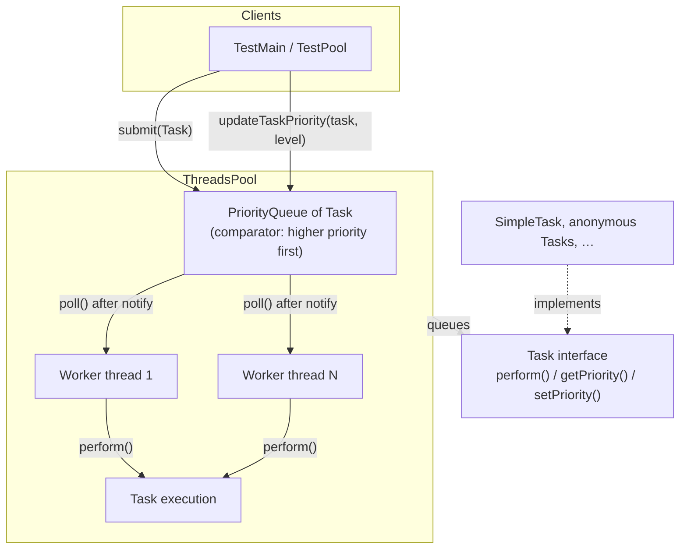
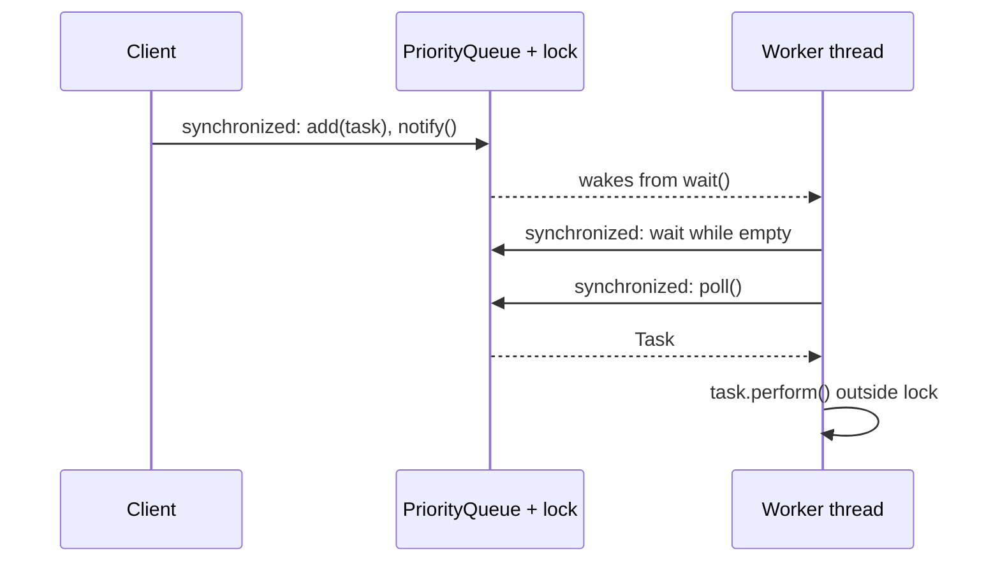
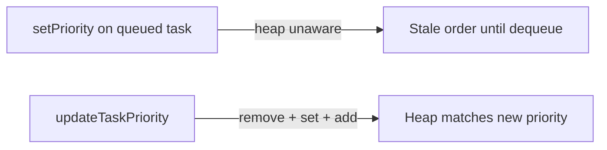

# xpool — priority thread pool (Java)

Small educational Java library that runs **`Task`** instances on a fixed pool of worker threads. Tasks are stored in a **`PriorityQueue`** ordered so **higher `getPriority()` values run first**. Includes demos/tests for ordering, synchronization, and **safe dynamic priority changes** via the pool API.

## Architecture (overview)



Workers block on an **empty queue** with `wait()`; **`submit`** adds a task and **`notify()`** wakes one waiter. Only **one thread at a time** may manipulate the queue (`synchronized (taskQueue)`), which keeps scheduling and priority updates consistent.

## Lifecycle: submit vs worker



`perform()` runs **outside** the monitor so long-running tasks do not block other threads from enqueueing or dequeuing work.

## Dynamic priority

Java’s `PriorityQueue` does **not** re-heapify when you only call `task.setPriority(...)`. This project exposes **`ThreadsPool.updateTaskPriority(Task task, int newLevel)`**, which **removes** the task from the queue when present, updates priority, and **re-inserts** it so ordering stays correct. If the task is already running (not in the queue), priority is still updated on the object; running work is not forcibly stopped.



## Repository layout

| Path | Role |
|------|------|
| `src/il/ac/hit/xpool/Task.java` | Task contract + note on dynamic priority |
| `src/il/ac/hit/xpool/ThreadsPool.java` | Queue, workers, `submit`, `updateTaskPriority` |
| `src/SimpleTask.java` | Simple `Task` implementation (default package) |
| `src/TestPool.java` | Short demo `main` |
| `src/il/ac/hit/tests/TestMain.java` | Priority, sync, and API comparison tests |

## Requirements

- **JDK** (e.g. 17+). On macOS with Homebrew OpenJDK, typical install path: `/opt/homebrew/opt/openjdk`.

## Build and run (command line)

From the project root:

```bash
export JAVA_HOME="/opt/homebrew/opt/openjdk/libexec/openjdk.jdk/Contents/Home"   # adjust if needed
export PATH="$JAVA_HOME/bin:$PATH"

mkdir -p out
javac -d out $(find src -name "*.java")

java -cp out il.ac.hit.tests.TestMain
# or
java -cp out TestPool
```

### Important: process does not exit by itself

Worker threads use a **`while (true)`** loop and wait on the queue. They are **non-daemon** threads, so after `main` returns the **JVM keeps running** until you **stop the process** (e.g. Ctrl+C in the terminal) or add an explicit shutdown mechanism.

## IDE

Open this folder as a Java project (IntelliJ module file may be present locally). Mark `src` as a source root and run **`TestMain`** or **`TestPool`**.

## Behavioral guarantees (intended)

- **Scheduling**: Among queued tasks, higher **`getPriority()`** is executed before lower (ties follow `PriorityQueue` ordering).
- **Thread safety**: Queue mutations and `updateTaskPriority` are guarded by the same lock.
- **Failures**: Uncaught exceptions from `perform()` are caught per task so workers keep running (errors go to stderr).

## License / context

Academic-style thread-pool exercise (package namespace `il.ac.hit`). Add a license file here if you publish the repo publicly.
